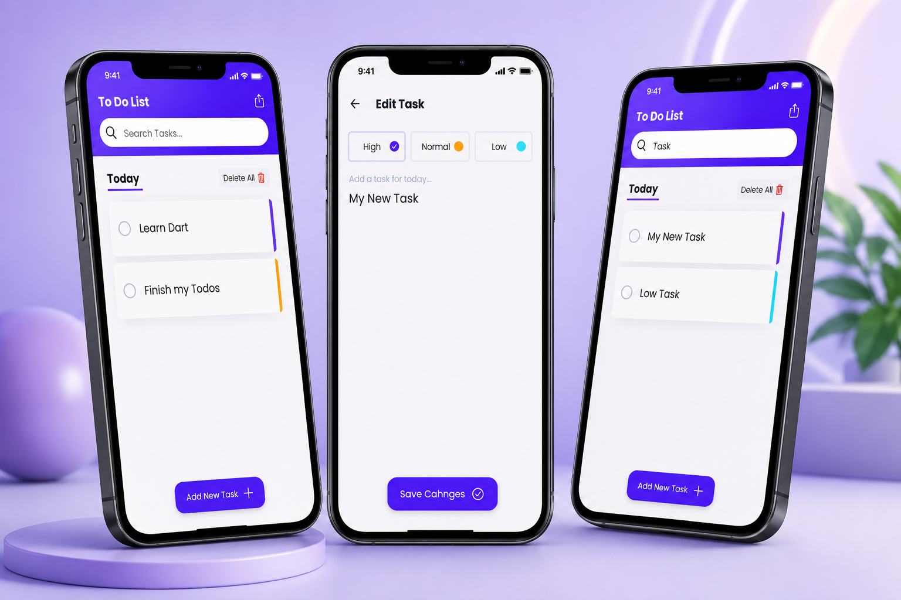

# 📱 Flutter ToDo App

A simple **ToDo App** built with **Flutter**.
This is my **Flutter exercise**.
This project has been created under the 7learn course flag, Thanks.

---

## ✨ Features

* ☀️ Light Theme
* 🎨 Clean Material Design
* ⚡ Responsive Layout
* 🌐 Web & Mobile Support
* 👌 Best practices for performance

---

## 📸 Screenshots

### ☀️ Light Theme



---

## 🚀 Getting Started

### Clone Repository

```bash
git clone https://github.com/funnypar/todo.git
```

### Go to Project Folder

```bash
cd todo
```

### Install Dependencies

```bash
flutter pub get
```

### Run App

```bash
flutter run
```

---

## 🛠️ Built With

* Flutter
* Dart
* Material Design

---

## 📚 What I Learned

* Flutter Layout
* MaterialApp & Scaffold
* ThemeData
* Widget Structure


## 👨‍💻 Author

**Parsa Norouzi**

GitHub: https://github.com/funnypar

---

## ⭐ Support

If you like this project, please give it a ⭐ on GitHub!
